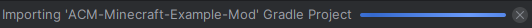
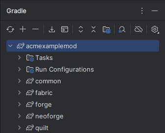
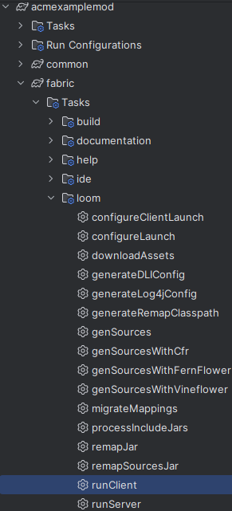
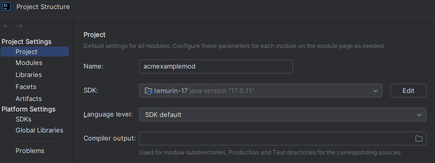
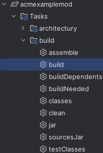
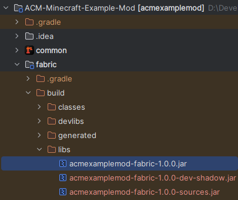

# ACM Minecraft Mod Template
This mod template is designed to help you get started making a basic Minecraft mod. This README file contains a basic
guide to set up a development environment and test your mod.

**This branch contains the finished mod with a new block added to the game. It's recommended to start with the main branch instead!**
Use this branch if you're stuck on the main branch or want to copy a portion of the code.

This template is designed to create a mod for Minecraft 1.20-1.20.4.
## Background Information
Before beginning, there's a few things that are important that you know. Unlike many modern games, Minecraft lacks
official mod support. To actually add a mod to Minecraft we need to use something called a mod loader. If you've played
with Minecraft mods before, you may already be aware of this. There are four mod loaders that are available for Minecraft:
[Fabric](https://fabricmc.net/), [Forge](https://files.minecraftforge.net/), [NeoForge](https://neoforged.net/), and
[Quilt](https://quiltmc.org/). Forge was historically the most common mod loader, however, many mods are now developed
exclusively for Fabric, as it has certain benefits over Forge, and NeoForge is used by many previously Forge mods on
the most recent (1.21+) versions of Minecraft. This mod template allows you to create a mod for all four mod loaders
using a plugin called [Architectury](https://docs.architectury.dev/plugin/introduction) and the [Architectury API](https://docs.architectury.dev/api/introduction).
## Getting Started
### Configuring the IDE
To get started, first you'll need a Java IDE to run the project. It is heavily encouraged to use either IntelliJ IDEA or
Eclipse, as these IDEs are the most common for Minecraft Mod Development. This template/tutorial is based on the IntelliJ
IDEA IDE.

Then, clone this project (or simply download it), and open it in your preferred IDE. The IDE should automatically begin
setting up the project. In IntelliJ IDEA, you should see a blue bar in the bottom right corner showing its progress. Wait
until this finishes before proceeding. If an error occurs check the [Common Issues](#common-issues) section.

If your using Eclipse as your IDE, you may want to run the `genEclipseRuns` Gradle task which is under
"acmexamplemod" > "Tasks" > "ide".

Now, on the left of your screen you should see an icon that looks like an elephant
. This opens Gradle. If the project successfully set up it should
look like this:

### Testing Your Mod
To test your mod, all you need to do is run the `runClient` task for the mod loader you wish to test. The button is
located under "acmexamplemod" > "[fabric/forge/neoforge/quilt]" > "Tasks" > "loom". Pressing it will run any necessary
Gradle tasks and start a Minecraft application with the selected mod loader installed.

It is recommended to try running Fabric first as the Fabric mod loader is less strict and more likely to successfully
launch. If you encounter any errors see [Common Issues](#common-issues) below.

**IMPORTANT!** The Forge `runClient` task will **NOT** launch. This is a bug caused by an incompatibility between Forge
and Architectury, and you cannot fix it. Instead, to test your mod on Forge, you'll need an instance of Minecraft with
Forge mod loader installed. Further information on how to do this will be below.

#### How do I know it's working?
If Minecraft launches successfully, the project should be working. You can double-check that the mod was successfully
installed by clicking the "Mods" button in the Minecraft menu. Note that some mod loaders do not have this menu option.
### Understanding the Project Layout
Looking at the project folder may cause you to freak out, but don't worry, it's actually pretty simple.
First, notice the "common" directory. This is where most of your work will be done. Your code, resource files, textures,
and custom classes will all be added right here.

Next, are the four mod loader directories "fabric", "forge", "neoforge", and "quilt". This is where code exclusive to
each mod loader is added and the details of the mod are described. For basic stuff, you won't have to do much here, just
know that this is technically where your mod will start executing from and that it will call stuff from "common".

Finally, are the top-level files. The most important are "gradle.properties", "build.gradle", and "settings.gradle".
Each one does a separate job. "gradle.properties" allows you to quickly change important values across the project. For
example, when changing Minecraft versions, you can simply change the version here, and Gradle will automatically update
the Minecraft version it loads and the Minecraft version restrictions in the "mods.toml" and "mod.json" files.
"build.gradle" is a configuration file that sets up Gradle, which you may have to change occasionally. "settings.gradle"
defines where Gradle should look to automatically download dependencies. If you change dependencies, you'll need to modify
this file.

The other files and folders shouldn't need to be changed. Note that the "images" directory, "README.md", and
"UNLICENSE.txt" are not directly related to the mod or project configuration and can be safely deleted if desired.
## Developing the Mod
This section will be covered during the meeting. However, if you need some additional help, here's links to important
documentation on how to create a mod. It's recommended to try to get your mod working on Fabric before moving on to the
other mod loaders. There are also many YouTube tutorials, but it's recommended to find one which utilizes Architectury.

**This branch contains finished code for developing the mod, so this step has effectively been skipped.**

Documentation:
- [Architectury API](https://docs.architectury.dev/api/introduction) (Recommended to Start Here, make sure to read the
[Registry section](https://docs.architectury.dev/api/registry), it's crucial to getting your mod to work.)
- [Fabric Developer Wiki](https://wiki.fabricmc.net/tutorial:start) (Highly Recommended)
- [NeoForge Documentation](https://docs.neoforged.net/docs/1.20.4/gettingstarted/)
- [Forge Docs](https://docs.minecraftforge.net/en/latest/gettingstarted/)
- [Quilt DevWiki](https://wiki.quiltmc.org/en/introduction/getting-started)
## Common Issues
### Setting up the JDK
The most common issue is the Java Development Kit being improperly configured. This can cause many other problems, so
it's a good first troubleshooting step. Here's how to fix it.
1. Navigate to "File" > "Project Structure" in the menu in the top left corner.
2. You should see the below image. Make sure that a SDK is selected (you can download one from the selection box). 
To ensure that there's no compatibility issues, it's recommended to select an SDK matching the Java version needed
   for the Minecraft version being developed (Java 17 is the version we're using). Language level should also be set
to 17 or SDK default (as long as SDK is Java 17). Which SDK you download is up to you. 
3. Reload Gradle by clicking  once done.
### Updating Gradle
This step should not be necessary, but if the gradle version is somehow incorrect, it may cause issues. To update gradle
you'll need to run a gradle task manually. To do so, open the gradle menu and click this button 
and run the following command: `gradle wrapper --gradle-version 8.13`.
### Errors when executing `runClient`
**IMPORTANT!** Running the `runClient` command for Forge will not work, and the game will freeze. This is not your fault.
There is a known issue with Forge and Architectury. Instead, to test your mod on Forge, you'll need a instance of Minecraft with
Forge mod loader installed. Further information on how to do this will be below.

If you experience an error while running `runClient`, there are several possible reasons, but here's some troubleshooting steps.
1. If you've modified this template mod, the error may be caused by your changes. You should check that the unmodified 
template mod works first to see if the error is caused by your modifications or by a configuration problem.
2. If you see the error `java.lang.IllegalStateException: Failed to find system mod: minecraft` don't worry! You don't
need to try to download Minecraft somehow, Gradle has handled that. The error actually means that your `mods.toml` file
couldn't be parsed, likely due to a typo or improper statement.
3. If neither of the both apply, you may have an improper JDK configuration. Check [Setting up the JDK](#setting-up-the-jdk)
section above.
4. If that still doesn't correct the issue, you'll have to seek further advice on how to fix the problem. If you can't find
anything else online, the [Architectury Discord server](https://discord.gg/C2RdJDpRBP) is a great place to ask for help
or look to see if anyone else has had the same problem.
### Unknown Warnings
Unless Minecraft fails to launch or your mod is missing from the game, you should be able to safely ignore these warnings.
Note: By default, this mod adds nothing to the game. That's what you're here to learn how to do!

If you want to explore further and try to eliminate these errors, that's up to you, but for large complex systems such
as Minecraft modding, it may not always be possible, so don't waste too much time if they're not causing issues.
## How to Use the Completed Mod?
Once you're finished with the mod (or simply want to test it with other mods), you'll need to get the mod's .jar file.
There is a .jar file for every mod loader. To create one, you'll need to run the `build` Gradle task. You can do this for
each mod loader or every mod loader at the same time by navigating to "acmexamplemod" > "Tasks" > "build" > "build".

Once complete, the .jar files will be located in the project folder on the left. Each one will be in their respective mod
loader's directory under "[fabric/forge/neoforge/quilt]" > "build" > "libs". It's normal for there to be multiple files here. Ignore the "sources" and "dev-shadow" .jar files. If there's still
several files, and you're not sure which is the one you need try running the `clean` gradle command, which is in the same
place as the `build` command. This removes unnecessary files, and you'll need to run `build` again afterwards.

Once you have the .jar file, you can add it to any modpack or instance of Minecraft in the same manner you would any other
mod. If you want to distribute the mod to others, this .jar file contains everything needed (except for the Architectury
API, but they will be prompted to install it).
## Additional Information
### What is UNLICENSE.txt?
To ensure that you can use this project as a template for any mod you'd like to make, I've applied the UNLICENSE to this
template. This gives you the freedom to do what you want. If you'd like to use another license, simply replace
"UNLICENSE.txt" with your preferred license.
### Where can I Distribute My Mods?
If you decide you want to publicly distribute your mod, the two most popular and trusted websites are
[CurseForge](https://www.curseforge.com/minecraft) and [Modrinth](https://modrinth.com/).
### Why is Architectury API a Required Dependency?
Forge handles block and item registration differently from other mod loaders. To accomodate this, special registration
systems have to be set up. Trying to do this yourself is difficult and not recommended. Fortunately, Architectury has
provided the Architectury API, allowing us to simply call it, and Architectury API will handle this difference. As a
consequence, however, the Architectury API will be required by the finished mod.
### What About Mixins?
Mixins are a method to override Minecraft's actual code instead of utilizing an existing API or integrating with existing
functions. This may be necessary for some advanced mod features, but it also increases the risk of your mod being
incompatible with other mods. For simplicity, mixins has been removed from this template.
### Where did this Template come from?
This template was originally produced from [Architectury's template generator](https://generate.architectury.dev/),
which can be used to make a mod template utilizing Architectury for your desired Minecraft version and mod loaders.
